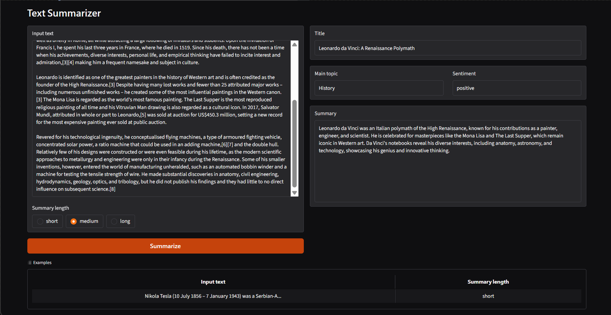

# AI Text Analyzer

AI Text Analyzer is a small Python application that uses the OpenAI API to analyze and summarize text through a simple Gradio interface.

It returns:

- A generated **title**
- The **main topic**
- The overall **sentiment**
- A summary with a selectable length



## Features

- Gradio-based web interface
- OpenAI-powered text analysis
- Structured JSON output
- Summary length selection:
  - **Short:** 1–2 sentences
  - **Medium:** 3–5 sentences
  - **Long:** 6–10 sentences
- Input validation
- JSON response validation
- Summary length validation
- Automatic retry when the generated summary does not match the requested sentence count
- Error handling for API, authentication, rate-limit, model, JSON, and validation errors

## Project Structure

```text
AI-text-analyzer/
├── images/
│   └── full.png
├── .gitignore
├── app.py
├── calling_model.py
├── json_validation.py
├── README.md
├── summary_length_validation.py
└── text_validation.py
```

## How It Works

The application follows this pipeline:

1. The user enters text and chooses a summary length.
2. `text_validation.py` validates and normalizes the input.
3. `calling_model.py` sends the text to the OpenAI API.
4. The model returns structured JSON containing:
   - `title`
   - `main_topic`
   - `summary`
   - `sentiment`
5. `json_validation.py` validates the returned fields and their types.
6. `summary_length_validation.py` checks that the final summary contains the requested number of sentences.
7. `app.py` displays the results in the Gradio interface.

## Requirements

- Python 3.10+ recommended
- An OpenAI API key

Install the required Python packages:

```bash
pip install gradio openai python-dotenv
```

## Environment Setup

Create a `.env` file in the project root:

```env
OPENAI_API_KEY=your_openai_api_key_here
```

The `.gitignore` is already configured to exclude `.env` files, virtual environments, Python cache files, Gradio-generated files, logs, and other generated output.

## Run the Application

From the project directory, run:

```bash
python app.py
```

Gradio will start the application and display a local URL in your terminal.

Open that URL in your browser to use the analyzer.

## Summary Length Options

| Option | Number of Sentences |
|---|---:|
| Short | 1–2 |
| Medium | 3–5 |
| Long | 6–10 |

If the model returns the wrong number of summary sentences, the application can retry with correction feedback before returning an error.

## Output Format

The model is instructed to return a structured object in this form:

```json
{
  "title": "Example Title",
  "main_topic": "Artificial Intelligence",
  "summary": [
    "First summary sentence.",
    "Second summary sentence."
  ],
  "sentiment": "neutral"
}
```

The allowed sentiment values are:

```text
positive
neutral
negative
```

## Main Files

### `app.py`

Contains the Gradio interface and the main application pipeline.

### `calling_model.py`

Loads the OpenAI API key, builds the prompt and JSON schema, calls the OpenAI Responses API, and handles API-related errors.

### `text_validation.py`

Validates the input text and requested summary length.

### `json_validation.py`

Checks that the model output contains exactly the expected fields and valid values.

### `summary_length_validation.py`

Counts summary sentences and verifies that the result matches the selected summary length.


The project's `.gitignore` excludes environment files from Git.

## License

No license is currently included in this repository.
